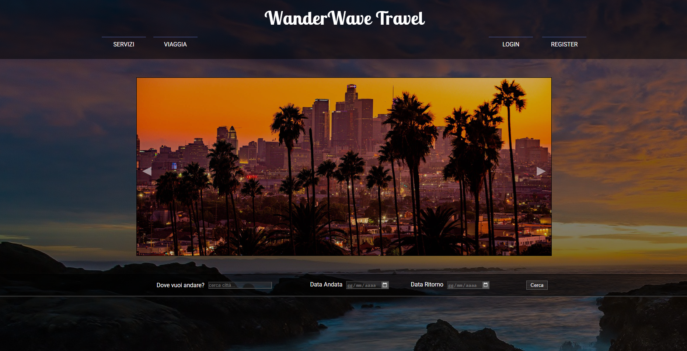
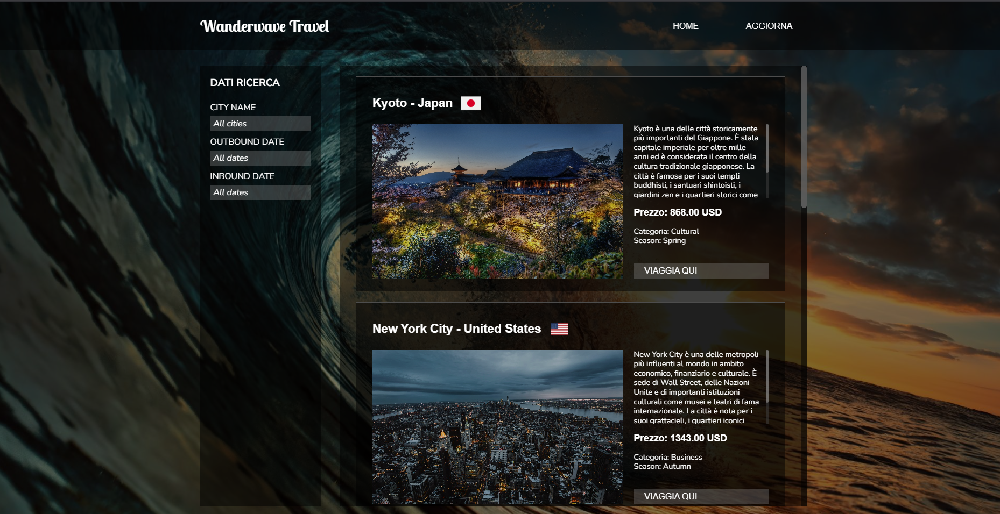
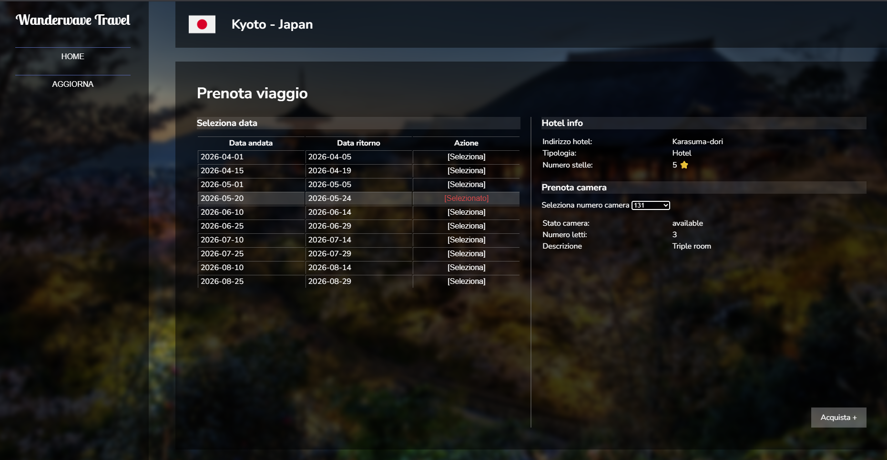
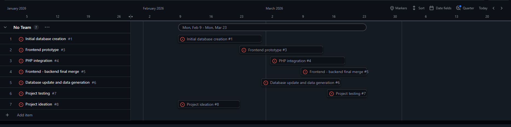

# Web Agenzia Viaggi

Progetto di gruppo scolastico di TPSIT e Informatica 2025/2026.

Il sito, denominato Wanderwave Travel, è una piattaforma web per la gestione delle prenotazioni di viaggi all’estero, dotata di un database che rende il sistema dinamico, consentendo la scrittura e la visualizzazione dei dati.

LINK SITO WEB: http://wanderwavetravel.altervista.org/source/interfaces/home/home.php

# Obiettivi

L’obiettivo del progetto era realizzare una piattaforma web per la ricerca e la prenotazione di viaggi, offrendo agli utenti un’interfaccia intuitiva e diverse funzionalità per la gestione delle proprie prenotazioni.

In particolare, il sito doveva consentire di:

* Visualizzare una homepage con slideshow informativo.
* Navigare tra le varie sezioni tramite una navbar intuitiva.
* Selezionare destinazioni e viaggi disponibili.
* Effettuare prenotazioni di viaggi.
* Prenotare strutture alberghiere.
* Registrarsi e accedere alla piattaforma tramite autenticazione.
* Effettuare il logout in modo sicuro.
* Ricercare viaggi attraverso strumenti di ricerca dedicati.

# Tecnologie usate

* HTML
* CSS
* JavaScript
* PHP
* MySQL
* GitHub

# Problemi riscontrati

Una delle difficoltà incontrate durante la progettazione del sito è stata la realizzazione della barra di ricerca presente nella homepage. Si tratta di un campo di input di tipo text che, mentre l’utente digita, mostra in tempo reale i viaggi il cui nome contiene il testo inserito.

I risultati vengono visualizzati all’interno di un menu a discesa posizionato sotto il campo di ricerca. Inizialmente era possibile utilizzare un elemento HTML predefinito per ottenere un comportamento simile, ma questa soluzione offriva poche possibilità di personalizzazione grafica tramite CSS.

Per questo motivo è stato deciso di sviluppare il componente da zero, utilizzando gli stessi linguaggi impiegati per la realizzazione dell’intero sito web. Questa scelta ha richiesto più lavoro, ma ha permesso di ottenere un maggiore controllo sia sull’aspetto grafico sia sul funzionamento della ricerca.

Il problema principale era la necessità di trasferire i risultati delle query dal backend PHP al frontend JavaScript. Questo è stato risolto utilizzando funzioni asincrone.

Al caricamento delle risorse JavaScript viene inviata una richiesta al backend (PHP), il quale restituisce i dati relativi ai viaggi.

Successivamente, tramite la gestione di eventi di input e funzioni di ricerca in JavaScript, è stato possibile aggiornare dinamicamente i risultati mostrati nella form, rendendo la ricerca completamente interattiva e dinamica in tempo reale.

# Immagini sito web

## Home Page

Pagina principale in cui risiedono funzionalità principali come la navbar, lo slideshow e la barra di ricerca. Le pagine del sito web hanno uno stile panoramico; ciascuna pagina ha uno sfondo dedicato.

## Travel Page

La ricerca effettuata nella homepage porta a questa pagina, dove viene presentata una lista di viaggi con le rispettive informazioni sulle categorie e sul prezzo.

## Trip Page

Dopo aver selezionato il viaggio si prosegue con la prenotazione e il pagamento. Sono inoltre riportati dati aggiuntivi relativi al viaggio, informazioni sull’hotel e la prenotazione delle camere.

# GANTT 

# Conclusione

Il progetto ha permesso di sviluppare una piattaforma web completa per la ricerca e la prenotazione di viaggi, integrando frontend e backend e simulando il funzionamento di un servizio reale.

Durante lo sviluppo sono state consolidate competenze nell’utilizzo di HTML, CSS, JavaScript, PHP e MySQL, oltre alla gestione di contenuti dinamici e comunicazioni asincrone tra client e server.

L’esperienza ha inoltre permesso di migliorare la capacità di progettare e realizzare un’applicazione web strutturata, affrontando e risolvendo problemi tecnici legati allo sviluppo.
